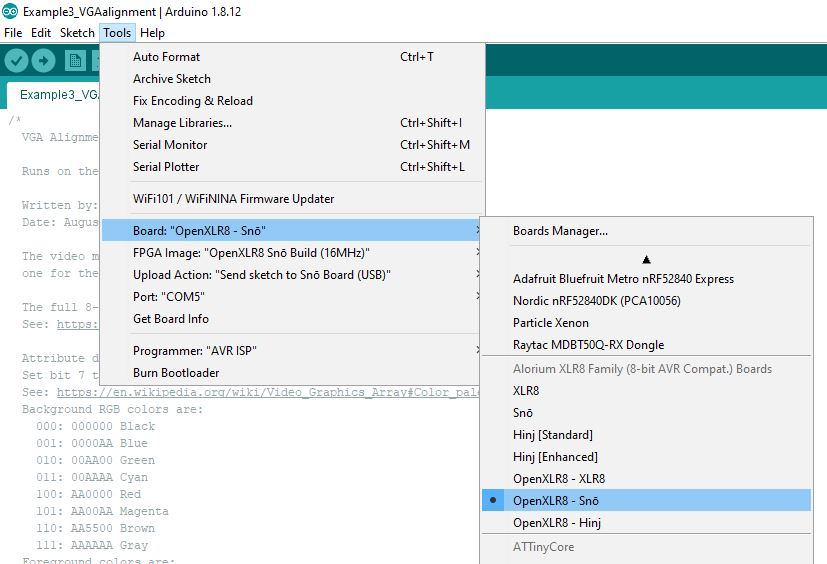
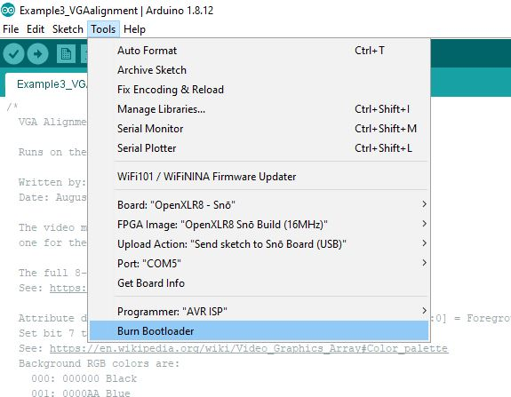

# XLR8 VGA HDMI XB - Installation

Alorium Technology have put together a comprehensive set of resources showing how to work with the Snō and Xcelerator Blocks (XBs):

- https://www.aloriumtech.com/sno-quickstart/
- https://www.aloriumtech.com/documents/Sno_Pin_Map.pdf
- https://www.aloriumtech.com/sno-support/
- https://www.aloriumtech.com/openxlr8/
- https://www.aloriumtech.com/xcelerator-blocks/
- https://www.aloriumtech.com/webinars/

The _**Intro to OpenXLR8**_ webinar contains a _lot_ of useful information. You will need to watch that if you are using Snō and XBs for the first time.

Steps 1 and 2 in the [quickstart](https://www.aloriumtech.com/sno-quickstart/) will show you how to communicate with the Snō via the FTDI interface and
check that it appears as an Arduino Uno in the Arduino IDE. Try running the standard Blink example (File\Examples\01.Basics\Blink) to make the Snō's blue LED flash.

Step 3.1 shows you how to install the XLR8 Boards Support Package which will add support for the Snō.

When you get to step 3.2, you will need to install the following libraries:
- **XLR8Info**
- **XLR8Core**
- **XLR8BuildTemplate**
- **XLR8DigitalIO**
- **XLR8LFSR** is useful if you want to follow along with the webinar example

Skip steps 3.3 onwards.

If you want to make any changes to the Verilog for the VGA HDMI XB, then you will need to follow all the instructions in the [Introduction to OpenXLR8](https://www.aloriumtech.com/openxlr8/).
_However, if you just want to use the VGA HDMI XB **as-is**, then you don't need to install Quartus Prime._

To install and use the VGA HDMI XB:
- [Download a zip file of this repo](https://github.com/PaulZC/XLR8_VGA_HDMI_XB/archive/master.zip)
- Unzip the zip file
- Copy the [XLR8Build](./XLR8Build) folder into your Arduino\libraries folder
- In the Arduino IDE, use the Tools menu to select **OpenXLR8 - Snō** as the board. (Don't select **Snō**)

- Leave the FPGA Image set to **OpenXLR8 Snō Build (16MHz)**
- Leave the Upload Action set to **Send sketch to Snō Board (USB)**
- Check you have the correct Port selected for your FTDI cable
- Click **Burn Bootloader** to program the FPGA with the XLR8Build (VGA HDMI) XB. This takes a while...
- The Snō should start generating a blank VGA image
- Now open one of the examples from the [Examples folder](./XLR8Build/examples)
- Click the right-arrow symbol to upload the example code to the FPGA

Enjoy!

_**Paul**_
